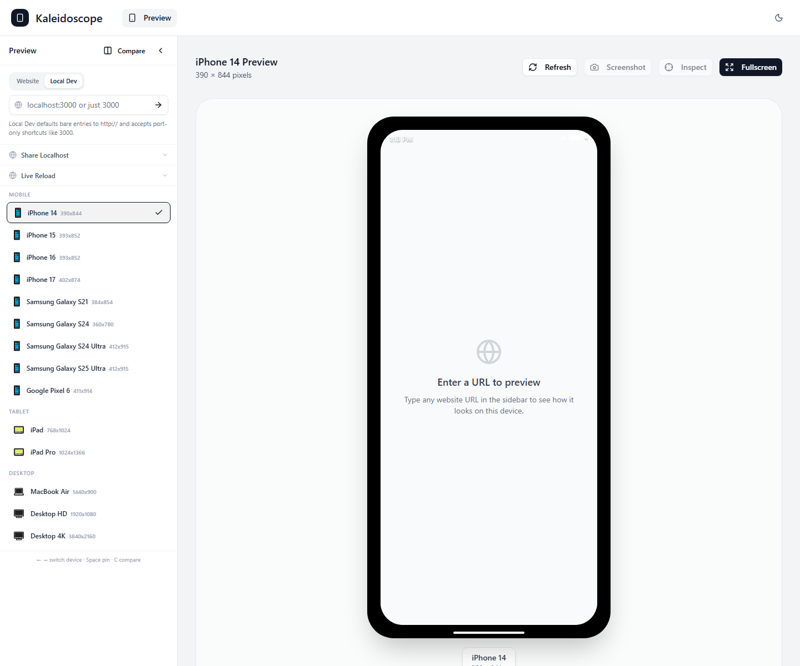
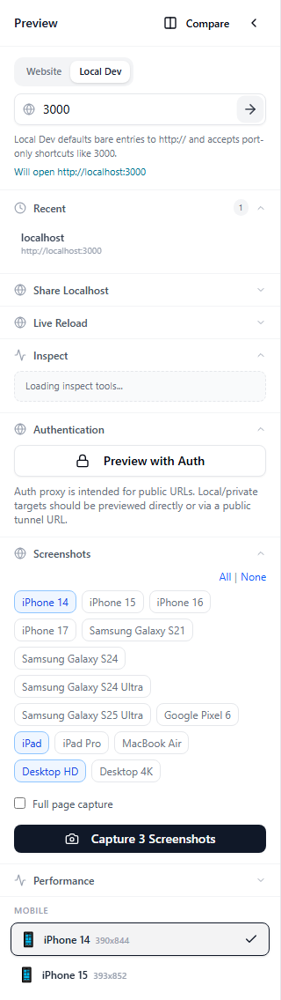
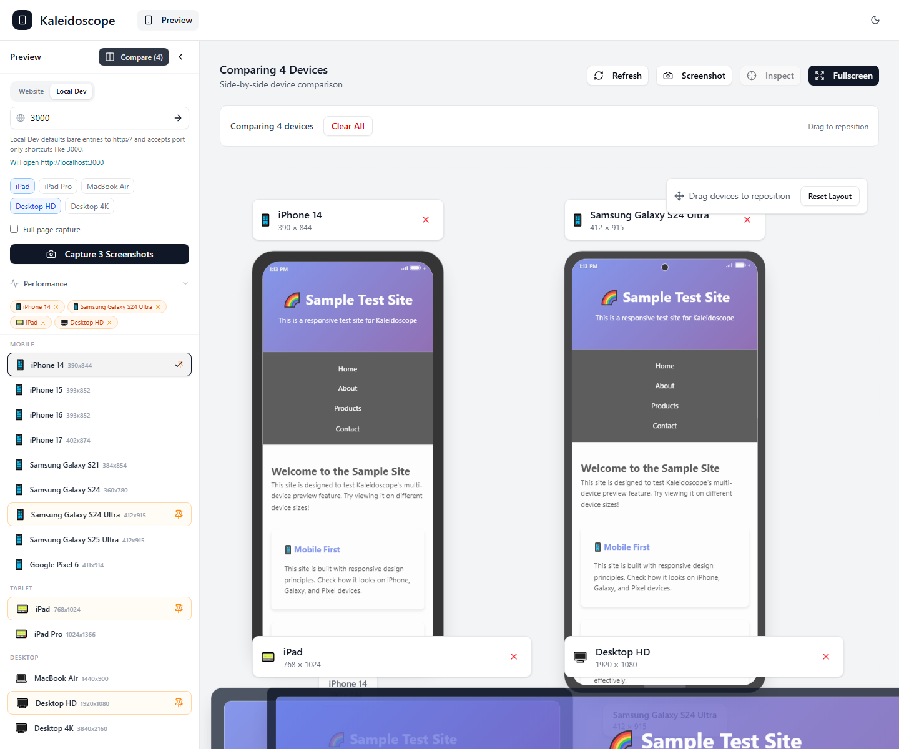
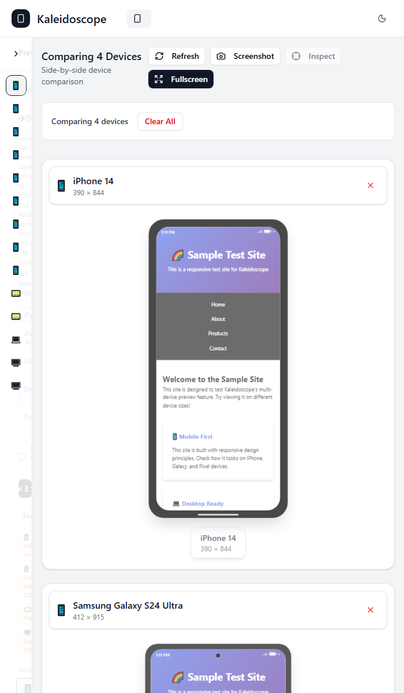

<p align="center">
  
</p>

# Kaleidoscope

Kaleidoscope is a responsive preview and inspection tool for web apps. Load a local or public URL once, view it across device profiles, capture screenshots, inspect trusted local pages, and let MCP clients automate the workflow.

<p align="center">
  
</p>

## What You Can Do

- Preview local and public HTTP/HTTPS pages across mobile, tablet, and desktop devices.
- Compare multiple breakpoints side by side.
- Capture screenshots across several device profiles in one run.
- Record scripted walkthrough videos with visible cursor movement.
- Preview authenticated pages with temporary cookie and header injection.
- Inspect trusted local pages and map selected elements back to source context.
- Use MCP tools from Claude Code, Codex, Cursor, Windsurf, VS Code, and other stdio MCP clients.

## Visual Tour

<table>
  <tr>
    <td width="50%" valign="top">
      
      <br />
      <strong>Capture multiple devices in one pass</strong>
      <br />
      Queue mobile, tablet, and desktop screenshots from the sidebar without leaving the preview workflow.
    </td>
    <td width="50%" valign="top">
      
      <br />
      <strong>Compare layouts side by side</strong>
      <br />
      Pin devices and inspect how the same page behaves across very different breakpoints.
    </td>
  </tr>
  <tr>
    <td width="50%" valign="top">
      
      <br />
      <strong>Use it comfortably on narrow screens</strong>
      <br />
      Comparison mode falls back to a stacked layout so the workspace stays usable on smaller displays.
    </td>
    <td width="50%" valign="top">
      
      <br />
      <strong>Local-first preview workflow</strong>
      <br />
      Enter localhost shortcuts like <code>3000</code>, switch devices quickly, and move straight into inspect, auth, screenshots, or performance tools.
    </td>
  </tr>
</table>

## Install

Install the MCP package globally:

```bash
npm install -g kaleidoscope-mcp-server
```

The executable name is:

```bash
kaleidoscope-mcp
```

Screenshots and walkthrough recording require Playwright Chromium:

```bash
npx playwright install chromium
```

The npm package includes the Kaleidoscope MCP server, backend, and built web client. When an MCP tool needs Kaleidoscope and no server is already running, it can start the packaged runtime automatically.

## MCP Client Setup

Use `kaleidoscope-mcp` as a stdio MCP server command.

Claude Code, Claude Desktop, Cursor, Windsurf, VS Code, and similar clients:

```json
{
  "mcpServers": {
    "kaleidoscope": {
      "command": "kaleidoscope-mcp",
      "env": {
        "KALEIDOSCOPE_SERVER_URL": "http://localhost:5000"
      }
    }
  }
}
```

Codex `config.toml`:

```toml
[mcp_servers.kaleidoscope]
command = "kaleidoscope-mcp"
enabled = true
startup_timeout_sec = 20
tool_timeout_sec = 60

[mcp_servers.kaleidoscope.env]
KALEIDOSCOPE_SERVER_URL = "http://localhost:5000"
```

Codex desktop connector UI:

- Name: `kaleidoscope`
- Transport: `STDIO`
- Command to launch: `kaleidoscope-mcp`
- Arguments: leave empty
- Environment variable: `KALEIDOSCOPE_SERVER_URL=http://localhost:5000`
- Working directory: leave blank

You can also run it ad hoc with `npx`:

```bash
npx -y kaleidoscope-mcp-server
```

For MCP clients that use JSON config:

```json
{
  "mcpServers": {
    "kaleidoscope": {
      "command": "npx",
      "args": ["-y", "kaleidoscope-mcp-server"],
      "env": {
        "KALEIDOSCOPE_SERVER_URL": "http://localhost:5000"
      }
    }
  }
}
```

On Windows, using the installed `kaleidoscope-mcp` command is usually more reliable than wrapping `npx` through `cmd /c`.

## Common Workflows

### Preview A Local App

1. Start your app, for example on `http://localhost:3000`.
2. Ask your MCP client to run `kaleidoscope_start`.
3. Ask it to prepare a responsive preview for your URL.
4. Open `http://localhost:5000` if you want to use the visual workspace directly.

### Capture Screenshots

Use `capture_screenshots` with device IDs or common names:

```json
{
  "url": "http://localhost:3000",
  "devices": ["iphone-14", "ipad", "desktop-hd"]
}
```

Responses include screenshot metadata and Markdown-ready image references when the MCP client supports rich content.

### Record A Walkthrough

Use `record_walkthrough` with structured steps or a simple script:

```text
click #open-settings
type "hello@example.com" into #email
click button[type="submit"]
wait 800ms
```

Walkthroughs are saved as local `.webm` files and returned as MCP artifacts.

### Preview Authenticated Pages

Use `preview_with_auth` to create a temporary proxy session with cookies or safe custom headers. This is useful for checking logged-in screens without changing your app.

### Inspect A Local Page

Inspect mode works with trusted loopback targets such as `localhost` and `127.0.0.1`. It can discover likely selectors and return source context for selected elements when a workspace root is configured.

## MCP Tools

- `kaleidoscope_status`, `kaleidoscope_start`, `kaleidoscope_stop`
- `kaleidoscope_list_devices`
- `preview_responsive`
- `capture_screenshots`
- `record_walkthrough`
- `preview_with_auth`
- `inject_mock_data`
- `discover_page_elements`
- `inspect_element_source`

## Environment Options

- `KALEIDOSCOPE_SERVER_URL`: Kaleidoscope backend URL. Defaults to `http://localhost:5000`.
- `KALEIDOSCOPE_REQUEST_TIMEOUT_MS`: MCP request timeout. Defaults to `60000`.
- `KALEIDOSCOPE_WORKSPACE_ROOT`: source-inspection root for local projects.
- `KALEIDOSCOPE_ARTIFACT_ROOT`: allowed root for user-selected walkthrough output directories.
- `KALEIDOSCOPE_WALKTHROUGH_DIR`: default output directory for walkthrough videos.
- `KALEIDOSCOPE_PROXY_TIMEOUT_MS`: proxy request timeout. Defaults to `30000`.
- `KALEIDOSCOPE_PROXY_MAX_RESPONSE_BYTES`: proxy response byte limit. Defaults to `10485760`.

## Troubleshooting

- `Browser executable not found`: run `npx playwright install chromium` in the same environment that launches the MCP server.
- `spawn C:\Windows\system32\cmd.exe ENOENT`: install the package globally and configure your MCP client to run `kaleidoscope-mcp` directly.
- `sourceDir must be inside...`: set `KALEIDOSCOPE_WORKSPACE_ROOT` to the project root you want Kaleidoscope to inspect.
- `output_dir must stay inside...`: set `KALEIDOSCOPE_ARTIFACT_ROOT` or `KALEIDOSCOPE_WALKTHROUGH_DIR`, then use an output directory below it.
- Port conflicts: set `KALEIDOSCOPE_SERVER_URL=http://localhost:<free-port>` or stop the process using port `5000`.

## Privacy And Safety

- Kaleidoscope is designed for local preview and inspection workflows.
- The local API binds to `127.0.0.1` by default.
- Inspect mode is limited to loopback targets, and source reads must stay under `KALEIDOSCOPE_WORKSPACE_ROOT`.
- Walkthrough output directories must stay under `KALEIDOSCOPE_ARTIFACT_ROOT` or `KALEIDOSCOPE_WALKTHROUGH_DIR`.
- Auth proxy sessions are temporary and cleaned up automatically.
- Public tunnel URLs created with tools such as `cloudflared` or `ngrok` should be treated as public.

## License

Kaleidoscope is released under the MIT License. See [LICENSE](LICENSE).
